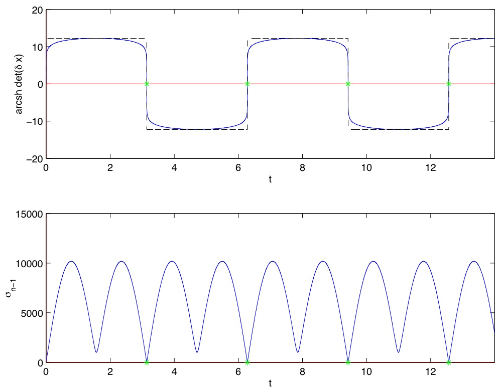

# cotcot: conditions of order two, conjugate times

[citation-img]: https://zenodo.org/badge/541187171.svg
[citation-url]: https://zenodo.org/doi/10.5281/zenodo.14722043

## Description

cotcot is a Matlab package designed to compute extremals in the case of *smooth* Hamiltonian systems, and to obtain the associated conjugate points with respect to the performance index of the underlying optimal control problem.

## References

1. <a href="http://caillau.perso.math.cnrs.fr/research/cocv-2007.pdf">Second order optimality
conditions in the smooth case and applications in optimal control</a> 
  Bernard Bonnard, Jean-Baptiste Caillau and Emmanuel Tr&eacute;lat 
  *ESAIM Control Optim. and Calc. Var.*,
  Vol. 13:2, pp. 207-236, 2007
1. <a href="http://caillau.perso.math.cnrs.fr/research/dcdsB-2005.pdf">Geometric optimal control of elliptic Keplerian orbits</a> 
  Bernard Bonnard, Jean-Baptiste Caillau and Emmanuel Tr&eacute;lat 
  *Discrete Contin. Dyn. Syst. Ser. B*,
  Vol. 5:4, pp. 929-956, 2005
1. <a href="http://caillau.perso.math.cnrs.fr/research/01582276.pdf">Computation of conjugate times in smooth optimal control: the COTCOT algorithm</a> 
  Bernard Bonnard, Jean-Baptiste Caillau and Emmanuel Tr&eacute;lat 
  *Proceedings of the 44th IEEE Conference on Decision and
  Control and European Control Conference ECC 2005*, pp. 929-933,
  Seville, December 2005
1. <a href="http://caillau.perso.math.cnrs.frx/research/anihp-2007.pdf">Riemannian metric of the averaged energy minimization problem in orbital transfer with low thrust</a> 
  Bernard Bonnard and Jean-Baptiste Caillau 
  *Ann. Inst. H. Poincar&eacute; Anal. Non Lin&eacute;aire*,
  Vol. 24:3, pp. 395-411, 2007

## Reproducible research

*An article about computational science in a scientific publication
is not the scholarship itself, it is merely advertising of the
scholarship. The actual scholarship is the complete software development
environment and the complete set of instructions which generated the
figures.*

J. Buckheit and D. Donoho (Stanford Univ.)

1. Figures 6 and 7 <a href="http://caillau.perso.math.cnrs.fr/research/cocv-2007.zip">code</a>
1. Figures 1 and 2 <a href="http://caillau.perso.math.cnrs.fr/research/dcdsB-2005.zip">code</a>
1. Figure 1, see [2] Figure 1
1. Figures 3, 4a-4d, 5 and 6a-6b <a href="http://caillau.perso.math.cnrs.fr/research/anihp-2007.zip">code</a>

## Download

cotcot <a href="cotcot.zip">package</a>
(Fortran 77, Adifor and Matlab 4 or higher required). 

    

Last modified: Fri 26 Nov 2009 14:41:56 CET
